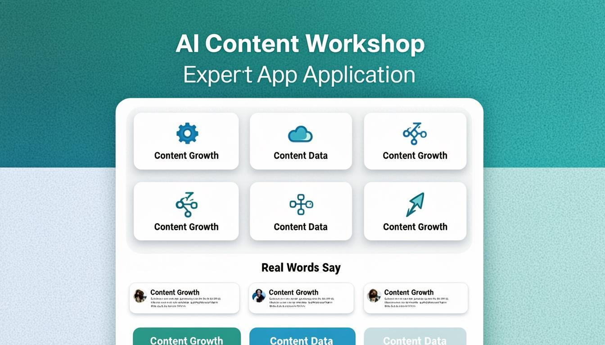
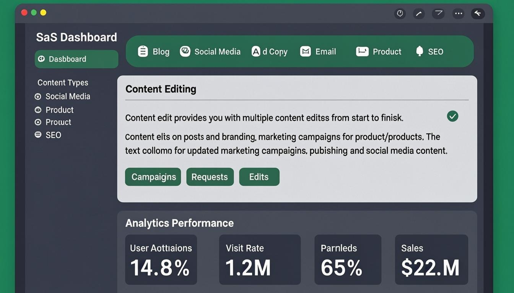
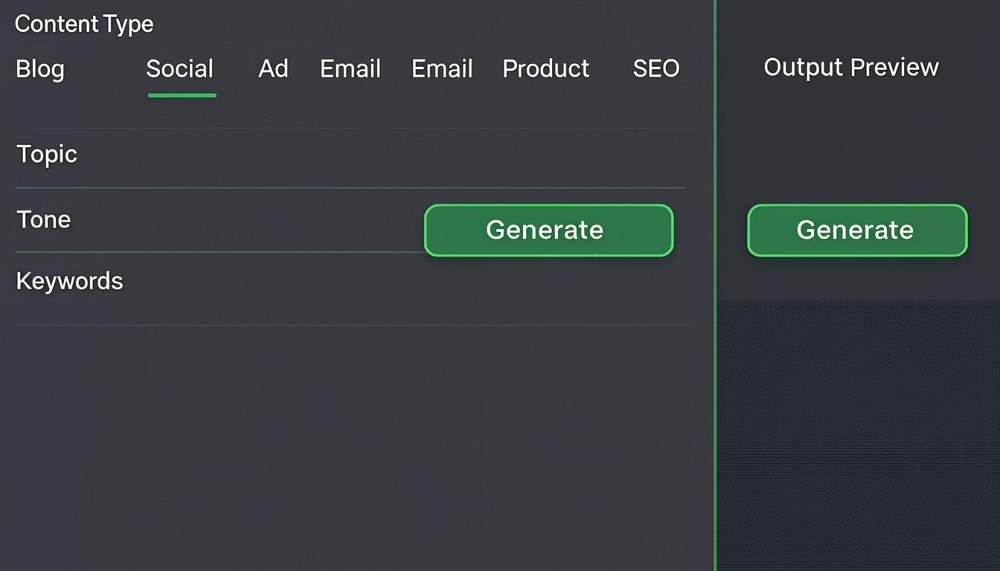
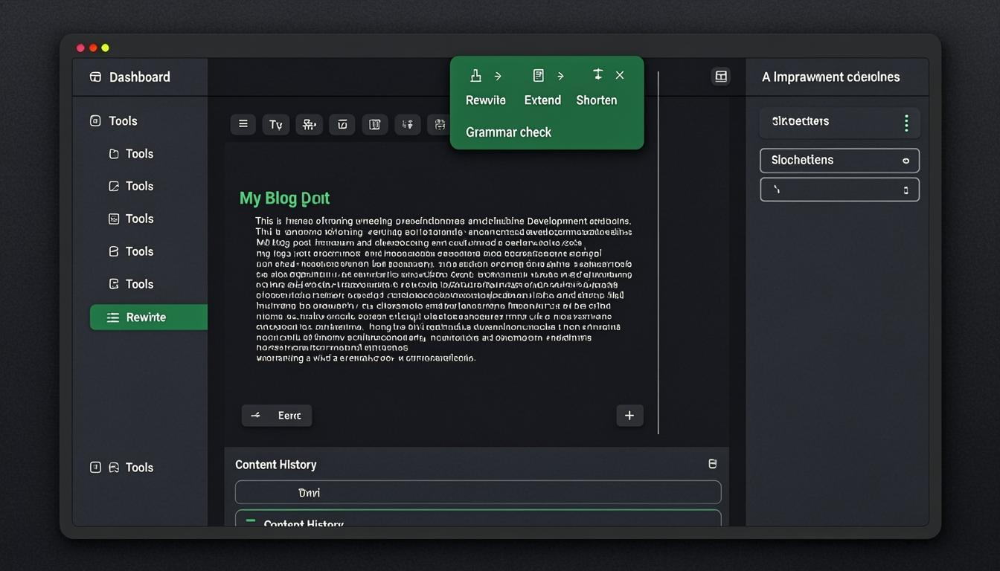
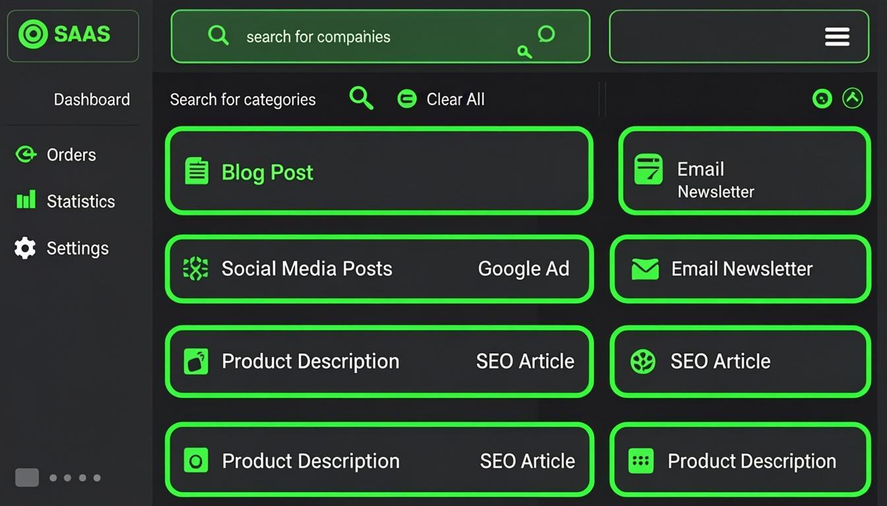

<div align="center">

# ✍️ ContentAI

### AI-Powered Content Creation Studio

**Generate professional content 10x faster with artificial intelligence**

[](https://nextjs.org/)
[](https://www.typescriptlang.org/)
[](https://www.prisma.io/)
[](https://tailwindcss.com/)
[](./LICENSE)

[](https://my-project-phi-eosin-87.vercel.app)
[](https://mehru676-ai-content-studio.hf.space)
[](https://github.com/Mehreen676/AI-Content-Studio/stargazers)
[](https://github.com/Mehreen676/AI-Content-Studio/issues)

[🚀 Live Demo](https://my-project-phi-eosin-87.vercel.app) · [📊 Hugging Face](https://mehru676-ai-content-studio.hf.space) · [🐛 Report Bug](https://github.com/Mehreen676/AI-Content-Studio/issues/new?template=bug_report.md) · [✨ Request Feature](https://github.com/Mehreen676/AI-Content-Studio/issues/new?template=feature_request.md)

</div>

---

## 📸 Screenshots

<table>
  <tr>
    <td align="center"><b>🏠 Landing Page</b></td>
    <td align="center"><b>📊 Dashboard</b></td>
  </tr>
  <tr>
    <td></td>
    <td></td>
  </tr>
  <tr>
    <td align="center"><b>✍️ Content Generator</b></td>
    <td align="center"><b>📝 Content Editor</b></td>
  </tr>
  <tr>
    <td></td>
    <td></td>
  </tr>
  <tr>
    <td align="center" colspan="2"><b>📁 Templates Browser</b></td>
  </tr>
  <tr>
    <td align="center" colspan="2"></td>
  </tr>
</table>

---

## 🌟 Overview

ContentAI is a full-stack SaaS application that leverages artificial intelligence to generate professional-quality content across multiple formats. Built with modern web technologies, it provides a seamless experience for content creators, marketers, and businesses to produce high-quality content in seconds rather than hours.

Whether you need SEO-optimized blog posts, viral social media content, high-converting ad copy, professional emails, compelling product descriptions, or search-optimized content — ContentAI handles it all with intelligent AI-powered generation and improvement tools.

---

## ✨ Features

### 🤖 AI Content Generation
- **Blog Post Generator** — SEO-optimized articles with proper heading structure, engaging introductions, and compelling conclusions
- **Social Media Content** — Platform-specific posts for Instagram, Twitter/X, LinkedIn, and Facebook with hashtags and emojis
- **Ad Copy Generator** — High-converting ad copy using AIDA, PAS, and BAB copywriting frameworks
- **Email Templates** — Professional emails with subject line variations, preview text, and effective CTAs
- **Product Descriptions** — Conversion-focused descriptions highlighting features, benefits, and social proof
- **SEO Content** — Search-optimized content with meta descriptions, title tags, and keyword placement

### 🎨 AI Content Improvement
- **Improve** — Enhance clarity, engagement, and impact while maintaining the core message
- **Rewrite** — Complete rewrite with fresh language and new structure
- **Expand** — Add depth, details, examples, and supporting evidence
- **Shorten** — Condense content while preserving key messages
- **Grammar Check** — Fix grammar, spelling, and punctuation errors automatically

### 📊 Content Management
- **Dashboard** — Real-time analytics, content stats, and recent activity overview
- **Content History** — Full history of generated and edited content with search and filters
- **Favorites** — Bookmark and organize your best content for quick access
- **Templates Library** — Browse and use pre-built templates for common content types

### 🔐 User Authentication
- **Sign Up / Login** — Secure user authentication with email-based accounts
- **User Plans** — Free, Pro, and Enterprise tier management
- **Profile Management** — User profile with plan details and usage tracking

### 🎯 UI/UX
- **Dark/Light Theme** — Full theme support with smooth transitions
- **Responsive Design** — Works perfectly on desktop, tablet, and mobile
- **Framer Motion Animations** — Smooth, professional animations throughout the app
- **shadcn/ui Components** — Beautiful, accessible, and customizable UI components

---

## 🛠️ Tech Stack

| Category | Technology | Purpose |
|----------|-----------|---------|
| **Framework** | [Next.js 16](https://nextjs.org/) | Full-stack React framework with App Router |
| **Language** | [TypeScript 5](https://www.typescriptlang.org/) | Type-safe development |
| **Styling** | [Tailwind CSS 4](https://tailwindcss.com/) | Utility-first CSS framework |
| **UI Components** | [shadcn/ui](https://ui.shadcn.com/) | Beautiful, accessible component library |
| **Database** | [SQLite](https://www.sqlite.org/) via [Prisma ORM](https://www.prisma.io/) | Lightweight, file-based database |
| **AI SDK** | [z-ai-web-dev-sdk](https://www.npmjs.com/package/z-ai-web-dev-sdk) | AI chat completions & content generation |
| **State Management** | [Zustand](https://zustand-demo.pmnd.rs/) | Lightweight, scalable state management |
| **Animations** | [Framer Motion](https://www.framer.com/motion/) | Production-ready motion library |
| **Icons** | [Lucide React](https://lucide.dev/) | Beautiful, consistent icon set |
| **Forms** | [React Hook Form](https://react-hook-form.com/) + [Zod](https://zod.dev/) | Performant forms with schema validation |
| **Charts** | [Recharts](https://recharts.org/) | Composable charting library |
| **Deployment** | [Vercel](https://vercel.com/) + [Hugging Face Spaces](https://huggingface.co/spaces) | Production hosting & Docker deployment |

---

## 📁 Project Structure

```
AI-Content-Studio/
├── 📂 prisma/
│   └── schema.prisma              # Database schema (User, Content, Template)
├── 📂 src/
│   ├── 📂 app/
│   │   ├── layout.tsx             # Root layout with theme provider
│   │   ├── page.tsx               # Main application page
│   │   ├── globals.css            # Global styles & Tailwind config
│   │   └── 📂 api/
│   │       ├── auth/route.ts      # Authentication API (signup/login)
│   │       ├── content/
│   │       │   ├── route.ts       # Content CRUD operations
│   │       │   └── [id]/route.ts  # Single content operations
│   │       └── 📂 ai/
│   │           ├── generate/route.ts  # AI content generation
│   │           └── improve/route.ts   # AI content improvement
│   ├── 📂 components/
│   │   ├── navbar.tsx             # Navigation bar
│   │   ├── landing.tsx            # Landing page with hero & features
│   │   ├── auth-dialog.tsx        # Login/signup dialog
│   │   ├── dashboard.tsx          # Dashboard with stats & charts
│   │   ├── content-generator.tsx  # AI content generation form
│   │   ├── content-editor.tsx     # Rich content editor
│   │   ├── templates-browser.tsx  # Templates library browser
│   │   ├── content-history.tsx    # Content history & management
│   │   └── 📂 ui/                 # shadcn/ui components (30+)
│   ├── 📂 lib/
│   │   ├── ai.ts                  # AI wrapper (SDK + env vars + demo mode)
│   │   ├── db.ts                  # Prisma client singleton
│   │   ├── store.ts               # Zustand global state
│   │   └── utils.ts               # Utility functions
│   └── 📂 hooks/
│       ├── use-mobile.ts          # Mobile detection hook
│       └── use-toast.ts           # Toast notification hook
├── 📂 screenshots/                # App screenshots for README
├── 📂 .github/                    # GitHub templates & CI/CD
├── Dockerfile                     # Docker configuration for HF Spaces
├── .dockerignore                  # Docker build exclusions
└── package.json                   # Dependencies & scripts
```

---

## 🚀 Getting Started

### Prerequisites

- **Node.js** 18+ 
- **npm** or **bun** package manager
- **Git** for version control

### Installation

```bash
# Clone the repository
git clone https://github.com/Mehreen676/AI-Content-Studio.git

# Navigate to the project directory
cd AI-Content-Studio

# Install dependencies
npm install

# Set up environment variables
cp .env.example .env
# Edit .env with your DATABASE_URL

# Initialize the database
npx prisma generate
npx prisma db push

# Start the development server
npm run dev
```

### Environment Variables

Create a `.env` file in the root directory:

```env
# Database
DATABASE_URL="file:./db/custom.db"

# AI Configuration (optional - falls back to demo mode if not set)
ZAI_BASE_URL="your-ai-api-url"
ZAI_API_KEY="your-api-key"
ZAI_CHAT_ID="your-chat-id"
ZAI_USER_ID="your-user-id"
ZAI_TOKEN="your-token"
```

> **Note:** The application works in **demo mode** without AI configuration. It generates professional template-based content. For full AI-powered generation, configure the AI environment variables.

---

## 🐳 Docker Deployment

### Build and Run Locally

```bash
# Build the Docker image
docker build -t ai-content-studio .

# Run the container
docker run -p 7860:7860 \
  -v content-db:/data/db \
  -e ZAI_BASE_URL="your-ai-api-url" \
  -e ZAI_API_KEY="your-api-key" \
  ai-content-studio
```

### Deploy to Hugging Face Spaces

The project includes a `Dockerfile` configured for HF Spaces deployment. The database persists at `/data/db/custom.db` using HF Spaces persistent storage.

---

## 🔗 API Endpoints

| Method | Endpoint | Description |
|--------|----------|-------------|
| `POST` | `/api/auth` | User signup/login (`action: "signup"` or `"login"`) |
| `GET` | `/api/content?userId=xxx` | Get all content for a user |
| `POST` | `/api/content` | Create new content |
| `PUT` | `/api/content/[id]` | Update content by ID |
| `DELETE` | `/api/content/[id]` | Delete content by ID |
| `POST` | `/api/ai/generate` | Generate AI content (`type`, `topic`, `tone`, etc.) |
| `POST` | `/api/ai/improve` | Improve existing content (`action`: improve/rewrite/expand/shorten/grammar) |

### AI Generate Request Example

```json
{
  "type": "blog",
  "topic": "The Future of AI in Healthcare",
  "tone": "professional",
  "keywords": "AI, healthcare, machine learning, diagnostics",
  "targetAudience": "healthcare professionals",
  "wordCount": 1500,
  "additionalInstructions": "Include real-world examples"
}
```

---

## 📈 Content Types & Capabilities

| Content Type | Description | Key Features |
|-------------|-------------|--------------|
| 📝 **Blog Post** | SEO-optimized articles | Headings, subheadings, intro hooks, CTAs |
| 📱 **Social Media** | Platform-specific posts | 3 variations, hashtags, emojis, engagement CTAs |
| 📢 **Ad Copy** | High-converting advertisements | AIDA, PAS, BAB frameworks, headlines, CTAs |
| 📧 **Email** | Professional email templates | Subject line variants, preview text, body, sign-off |
| 🛍️ **Product Description** | E-commerce product copy | Features, benefits, social proof, specifications |
| 🔍 **SEO Content** | Search-optimized content | Title tags, meta descriptions, keyword placement, schema |

---

## 🤝 Contributing

Contributions are what make the open source community such an amazing place to learn, inspire, and create. Any contributions you make are **greatly appreciated**.

1. Fork the Project
2. Create your Feature Branch (`git checkout -b feature/AmazingFeature`)
3. Commit your Changes (`git commit -m 'Add some AmazingFeature'`)
4. Push to the Branch (`git push origin feature/AmazingFeature`)
5. Open a Pull Request

Please read [CONTRIBUTING.md](./.github/CONTRIBUTING.md) for detailed guidelines.

---

## ⚖️ License

This project is licensed under the **Creative Commons Attribution-NonCommercial-ShareAlike 4.0 International License** — see the [LICENSE](./LICENSE) file for details.

<div align="center">

[](https://creativecommons.org/licenses/by-nc-sa/4.0/)

**You are free to:**
- ✅ Share — copy and redistribute the material in any medium or format
- ✅ Adapt — remix, transform, and build upon the material

**Under the following terms:**
- 🔄 **Attribution** — You must give appropriate credit to the original author
- 🚫 **NonCommercial** — You may NOT use the material for commercial purposes
- 📋 **ShareAlike** — If you remix or transform, you must distribute under the same license
- ❌ **No additional restrictions** — You may not apply legal terms or technological measures

</div>

---

## 👩‍💻 Author

<div align="center">

**Mehreen (Mehru)**

[](https://github.com/Mehreen676)
[](https://huggingface.co/mehru676)

</div>

---

## 🌐 Live Deployments

| Platform | URL | Description |
|----------|-----|-------------|
| **Vercel** | [my-project-phi-eosin-87.vercel.app](https://my-project-phi-eosin-87.vercel.app) | Primary deployment (serverless) |
| **Hugging Face** | [mehru676-ai-content-studio.hf.space](https://mehru676-ai-content-studio.hf.space) | Docker deployment with persistent DB |

---

## 🏆 Acknowledgments

- [Next.js](https://nextjs.org/) — The React Framework for the Web
- [shadcn/ui](https://ui.shadcn.com/) — Beautifully designed components
- [Prisma](https://www.prisma.io/) — Next-generation Node.js and TypeScript ORM
- [Tailwind CSS](https://tailwindcss.com/) — A utility-first CSS framework
- [Framer Motion](https://www.framer.com/motion/) — Production-ready animations
- [Lucide](https://lucide.dev/) — Beautiful & consistent icon set
- [z-ai-web-dev-sdk](https://www.npmjs.com/package/z-ai-web-dev-sdk) — AI integration SDK

---

<div align="center">

### ⭐ If you found this project helpful, please consider giving it a star!

[](https://star-history.com/#Mehreen676/AI-Content-Studio&Date)

**Built with ❤️ by [Mehreen](https://github.com/Mehreen676)**

</div>
